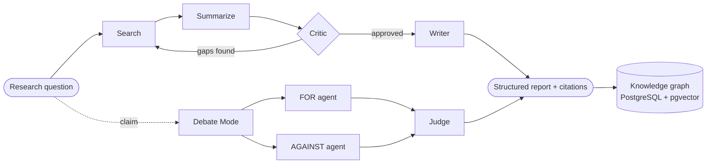
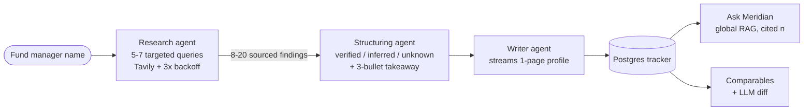
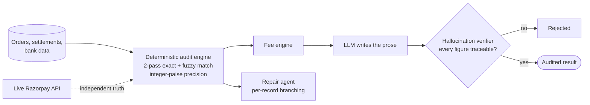
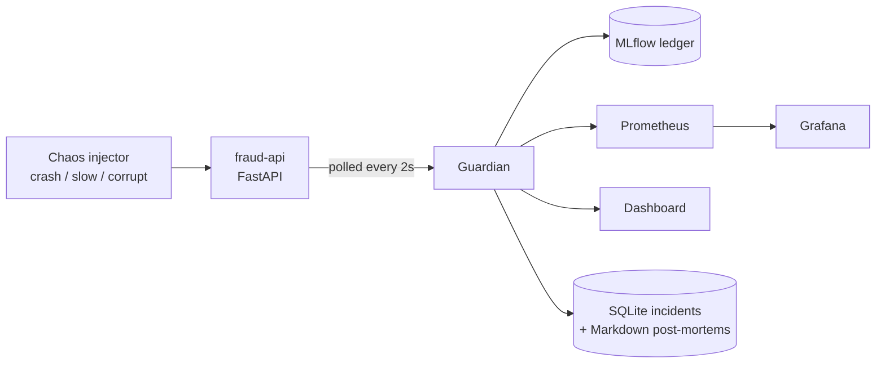
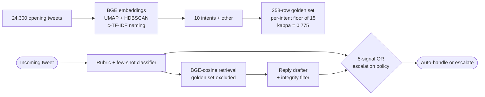
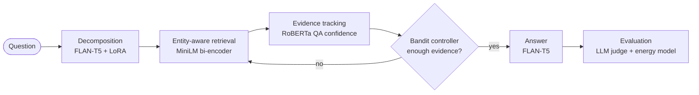
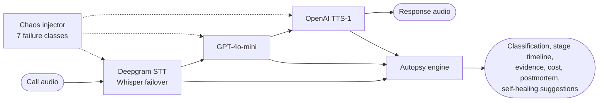

 

 

 

> ### ✨ *"I don't just train models. I build the systems that put them to work, and the instruments that tell me when they're wrong."*

---

## 🧬 About Me

I'm an AI/ML engineer pursuing a **B.Tech in Computer Science (AI & ML)** at Manipal University Jaipur, working where machine learning research meets production software engineering. My focus is generative AI, autonomous agents, retrieval-augmented systems, and the operational layer that keeps models honest once they're live.

| 🚢 **I ship deployed systems, not demos** | 🔬 **I evaluate before I claim** | 📝 **I write down what I rejected** |
|:--|:--|:--|
| Every flagship project has a container, a database and a deploy story. | Bootstrap CIs, Cohen's κ, ablations, hallucination audits, ground-truth confusion matrices. If a number can't survive scrutiny, it doesn't go in the README. | Decision logs, failure logs, honest-caveat sections. The reasoning is the artifact. |

<table>
<tr><td>🎓 <b>Education</b></td><td>B.Tech CSE (AI & ML), Manipal University Jaipur · 2023–2027</td></tr>
<tr><td>🧠 <b>Core Focus</b></td><td>LLMs · Multi-Agent Orchestration · RAG / GraphRAG · Deep Learning</td></tr>
<tr><td>🔭 <b>Also Exploring</b></td><td>NLP · Computer Vision · MLOps · Drift Detection · LLM Evaluation · Voice AI · Green AI</td></tr>
<tr><td>🚀 <b>Flagship</b></td><td>POLYNOUS, a 7-agent neural research OS (deployed, multi-user, BYO keys)</td></tr>
<tr><td>🧰 <b>Also Shipped</b></td><td>Meridian · ReconMint · GuardianOps · Delta Support Agent · EcoBudget · CallAutopsy</td></tr>
<tr><td>📄 <b>Research</b></td><td>1 published (IEEE 2026), 2 under review · federated security, HCI, LLM code auditing</td></tr>
<tr><td>💼 <b>Experience</b></td><td>ML Intern at Metabrix Lab · 3D face reconstruction (HRN)</td></tr>
</table>

---

## 🗺️ Portfolio at a Glance

| # | Project | What it is | Domain | Hardest part |
|:-:|:--|:--|:--|:--|
| 1 | 🪐 **[POLYNOUS](#-polynous--neural-research-os)** | 7-agent LangGraph research OS with a per-user knowledge graph | GenAI / Agents | Stateful orchestration + graph ML at request time |
| 2 | 📈 **[Meridian](#-meridian--ai-analyst-for-india--sea-private-markets)** | AI analyst for India + SEA private markets, per-field confidence | GenAI / FinTech | Structured extraction with source attribution |
| 3 | 💸 **[ReconMint](#-reconmint--ai-verified-financial-reconciliation)** | Deterministic payment reconciliation with a hallucination verifier | FinTech / Agents | Making AI unable to state an untraceable number |
| 4 | 🛡️ **[GuardianOps](#-guardianops--self-healing-mlops-safety-net)** | Self-healing MLOps safety net for a fraud API | MLOps / Reliability | Catching silent wrong-answer failure, not just crashes |
| 5 | ✈️ **[Delta Support Agent](#-delta-customer-support-agent--evaluation-first-nlp)** | Twitter triage + reply agent with a hand-labeled golden set | NLP / Evaluation | Evaluation rigorous enough to falsify my own claims |
| 6 | 🌱 **[EcoBudget](#-ecobudget--energy-aware-retrieval-for-greener-ai)** | Adaptive retrieval that stops when it has *enough* evidence | ML Research / Green AI | Accuracy–compute–energy trade-off with bandits |
| 7 | 🎙️ **[CallAutopsy](#-callautopsy--voice-ai-failure-forensics)** | Post-call failure forensics for STT → LLM → TTS pipelines | Voice AI / Observability | Pinning every failure to a specific pipeline stage |

---

## 🪐 POLYNOUS · Neural Research OS

A full-stack platform where **seven agents orchestrate over LangGraph** to search, summarize, critique, debate and write structured research reports, with live web citations, confidence scoring, and a **personal knowledge graph that grows per user**.

**Why it's non-trivial:** most agent demos are a single chain. POLYNOUS is a stateful graph with a critic loop and an adversarial debate mode, serving multiple authenticated users who bring their own keys across seven providers, with retrieved knowledge persisted as a traversable graph rather than thrown away after the response.

<b>✦ Capabilities</b>

| Capability | How it works | Tech |
|:--|:--|:--|
| **7-agent pipeline** | Search → Summarize → Critic → Writer → Debate, explicit state graph | LangGraph, Claude, GPT-4o-mini |
| **Debate Mode** | FOR / AGAINST / Judge agents argue a claim, streamed live | Claude, SSE |
| **Knowledge graph + GraphRAG** | Typed relationship traversal over per-user entities | PostgreSQL, pgvector |
| **Graph ML** | PageRank, community detection, link prediction, computed in-request | Pure Python, Canvas, Three.js |
| **Semantic search** | Constellation UI over embedded findings | Pinecone, Voyage AI |
| **BYO API keys** | 7 providers, encrypted at rest, never logged | Fernet (AES-128-CBC) |
| **Auth** | Google + GitHub OAuth 2.0, JWT sessions | FastAPI, JWT |
| **PDF analysis** | Upload, chunk, retrieve, with security scanning on ingest | PyPDF2, RAG |
| **Analytics** | Neural dashboard rendered on raw canvas, no chart library | Canvas API |
| **Deploy** | React/Vite on Cloudflare Pages, FastAPI on Railway | Docker, PostgreSQL |

---

## 📈 Meridian · AI Analyst for India + SEA Private Markets

Type a fund manager's name. A **3-agent pipeline** researches them, structures the findings into a strict Postgres schema with **per-field confidence**, produces an analyst-grade takeaway, and files it in a shared tracker you can query in plain English.

> Built deliberately as a job application: instead of sending a resume for the Lanmea Group AI & Software Engineering internship, I built the tool their own listing said they needed.

Every stage streams progress over SSE: `phase · queries · findings · profile · report_chunk · report_done · saved`.

<b>✦ Features</b>

| Feature | Detail |
|:--|:--|
| **Ask Meridian (⌘K)** | Global RAG across every firm's findings, answers cited `[n]`, firm names clickable |
| **Comparables** | 3 most similar firms per profile, scored on sector / stage / geography overlap |
| **Compare + LLM diff** | 2–4 firms side by side, plus an auto-generated "what distinguishes these" analysis |
| **First-class entities** | `fund_managers`, `deals`, `people`, `findings` each get a table with FKs, so cross-firm queries are cheap SQL |
| **Live signal card** | "3 fund closes in the last 90 days" plus most-recently-updated firms |
| **Analyst notes + watchlist** | Debounced autosave per firm; starred firms persisted per browser |
| **Exports** | CSV, Markdown, print-styled PDF |
| **Weekly automation** | GitHub Action hits `/api/refresh` every Monday to re-profile stale rows |
| **Hardening** | CORS, security headers, per-IP rate limiting (slowapi), optional shared-secret gate, non-root Docker user |

**Design principles:** sourced or silent · confidence, not vibes · a tracker, not a lookup · no fabrication even at empty state (seed rows are badged `seed`, never passed off as generated).

---

## 💸 ReconMint · AI-Verified Financial Reconciliation

An autonomous reconciliation agent built for the **Razorpay AI Buildathon 2026**. It resolves discrepancies across order, settlement and bank data with a fully **deterministic matching and fee-reconstruction engine**. AI is deliberately scoped to language generation only, and a custom **hallucination verifier** rejects any AI-stated figure that cannot be traced back to computed data.

<table align="center">
<tr>
<td align="center"><h3>97.7%</h3>match rate</td>
<td align="center"><h3>~12,700</h3>records / sec</td>
<td align="center"><h3>1.00</h3>recall</td>
<td align="center"><h3>0.93</h3>F1 vs held-out truth</td>
</tr>
</table>

**The thesis:** in finance, an LLM that is confidently wrong is worse than no LLM. So the numbers come from code, the prose comes from the model, and a verifier sits between them.

---

## 🛡️ GuardianOps · Self-Healing MLOps Safety Net

A fraud-detection API can fail two ways. It can **crash**, which is obvious and someone gets paged. Or it can **stay up and start giving quietly wrong answers** because a model got corrupted or an upstream pipeline shifted, approving fraud while every health check reads green. The second is far more expensive, and most monitoring never sees it.

GuardianOps is the second-opinion layer: it polls the fraud API, computes rolling **PSI + Kolmogorov–Smirnov** drift against a frozen baseline, and acts under an explicit two-tier policy.

| Tier | Trigger | Action |
|:--|:--|:--|
| **P-001** | Crash | Auto-restart, incident logged with real MTTR |
| **P-002** | Silent failure | Open an incident and **wait for a human** to authorize rollback (you can't silently mutate a live fraud model without compliance sign-off) |

<b>✦ What's inside</b>

| Layer | What's in it |
|:--|:--|
| **Drift detection** | PSI + `scipy.stats.ks_2samp` over a rolling 60-sample window vs a 200-sample startup baseline |
| **Confidence score** | 0–100 gauge that decays smoothly as PSI grows, so you watch drift build before it trips |
| **Explainability** | Plain-English reasoning on every incident: PSI, KS p-value, threshold, policy fired |
| **Chaos engineering** | Separate injector with three modes: crash, slow, corrupt (shifted Beta distribution, no crash, no latency spike) |
| **Ground truth** | 500 deterministic card transactions with ~4% injected fraud; `POST /replay` returns confusion matrix, precision, recall, F1 |
| **Runtime control** | `POST /config` mutates thresholds and cadence live, no restart |
| **Dashboard** | Single HTML file, zero build: oscilloscope trace, session ledger, baseline-vs-live histogram, narration console, print-ready incident report |
| **Ops discipline** | 7-service Docker Compose, GitHub Actions CI (3 parallel jobs), 9 pytest cases, `audit.sh` probing all 21 endpoints |

**What I documented rather than hid:** the scorer is rule-based on purpose (the project is the safety net around a model, not the model), the transaction stream is synthetic while the replay dataset is labeled, and the disabled settings slider is labeled *(fixed)* because an honest UI beats one that silently does nothing.

---

## ✈️ Delta Customer-Support Agent · Evaluation-First NLP

A triage and reply agent for Delta's Twitter support, built from the Kaggle *Customer Support on Twitter* dataset. I chose one brand from ~100, **derived the intent taxonomy from the data rather than from my head**, hand-labeled a golden set of 258 tweets, and built an LLM-first RAG agent that classifies intent, drafts a reply grounded in Delta's own historical replies, and decides auto-handle versus escalate.

**Head-to-head on a held-out 78-row eval slice**

| System | Intent acc | Intent macro-F1 | Escalate F1 | Reply (judge) | Reply (human-adj) |
|:--|:-:|:-:|:-:|:-:|:-:|
| Trivial baseline | 19.2% | 0.029 | 0.836 | 3.42 | 2.67 |
| TF-IDF + LR baseline | 37.2% | 0.378 | 0.625 | 4.17 | 3.42 |
| **LLM-RAG agent** | **71.8%** | **0.731** | **0.879** | **4.57** | **3.78** |

Reply quality is scored by an LLM judge (`gpt-4o-mini`, cross-family from the agent's `gpt-4o` to blunt self-preference bias) on groundedness, tone, actionability and safety, validated against a 40-row hand-scoring pass (Pearson r = 0.65; the judge over-scores actionability by +1.4, so human-adjusted numbers apply per-axis bias correction).

**What the evaluation caught that a demo never would**

- 🔍 A `grounded_in` audit found the model **inventing tweet_ids in 6/78 replies**. Prompt hardening took it to **0/78**.
- 📉 A hand-labeled escalation subset showed my derived escalation gold was only **κ = 0.29** against human judgment, so my reported numbers were inflated against a proxy. I updated the report to say so rather than quietly keep the better figure.
- 🧪 A **pre-registered κ prediction** had two of three predictions falsified, reported as such.
- 🗂️ A **27-entry decision log** records what I rejected, not just what I built.

---

## 🌱 EcoBudget · Energy-Aware Retrieval for Greener AI

A research-oriented retrieval system that explores how QA systems can **reduce unnecessary computation and energy use without sacrificing answer quality**. The core idea is **task-sufficient retrieval**: instead of fetching whole documents or endlessly searching, the system decides when it *already has enough evidence* to answer reliably.

> *How little evidence can an AI system retrieve while still producing a sufficiently correct answer?*

<table align="center">
<tr>
<td align="center"><h3>0.989</h3>Recall@1</td>
<td align="center"><h3>1.000</h3>Recall@5</td>
<td align="center"><h3>0.892</h3>decomposition exact match</td>
<td align="center"><h3>0.895</h3>task success</td>
<td align="center"><h3>0.944</h3>fact F1</td>
<td align="center"><h3>~66 J</h3>saved / query</td>
</tr>
</table>

| Component | Role |
|:--|:--|
| **FLAN-T5 + LoRA** | Query decomposition |
| **MiniLM bi-encoder** | Retrieval |
| **RoBERTa-based QA confidence** | Signals when evidence is sufficient |
| **LinUCB / SGD bandit / Thompson Sampling** | Stop-or-retrieve decisions |
| **Energy model** | Retrieval cost estimate (~66 J saved per query at the evaluated median page size of ~506 KB) |

Retrieved ~**106 bytes/query** in the evaluated setup versus ~**420 bytes/query** for full-page retrieval.

---

## 🎙️ CallAutopsy · Voice AI Failure Forensics

A post-call failure analysis platform for voice AI. Instead of judging a voice agent only by whether a call completed, CallAutopsy examines **which stage of the pipeline failed and why**, running on a *real* voice stack rather than mocked responses.

<table>
<tr>
<td valign="top" width="50%">

**💥 7 injectable failure classes**

1. Bad STT
2. LLM hallucination
3. TTS glitch
4. Timeout
5. Hangup
6. Network failure
7. Unhandled exception

</td>
<td valign="top" width="50%">

**🧾 Every autopsy contains**

- Failure classification
- Pipeline stage responsible
- Stage-by-stage timeline
- Failure evidence
- Per-call cost
- Postmortem report
- Suggested self-healing actions

</td>
</tr>
</table>

| Advanced evaluation | What it does |
|:--|:--|
| **Calibration confusion matrix** | Checks whether the failure classifier itself can be trusted |
| **Blast radius calculator** | Estimates impact of a failure beyond a single call |
| **A/B comparison** | Compares pipeline configurations head to head |
| **Adversarial hallucination suite** | Stress-tests the LLM with hard hallucination scenarios |
| **Microphone analysis** | Flags audio / input quality issues |

---

## 📄 Research

<table>
<tr>
<td>

### FedCL-NIDS
**Federated Closed-Loop Network Intrusion Detection with Automated YARA Rule Voting Consensus**

*Kasmya Bhatia, **Ashwarya Pradhan**, Dr. Gautam Kumar · Dept. of AI & ML, Manipal University Jaipur*

- Federated learning architecture for distributed, privacy-preserving intrusion detection: models train locally across decentralised nodes with **no raw data sharing**.
- Automated **YARA rule voting consensus** that dynamically generates and validates threat signatures, cutting false positives and adapting to novel attacks.

`Federated Learning` `Network Security` `YARA Rules` `Intrusion Detection` `Privacy-Preserving AI`

</td>
</tr>
<tr>
<td>

### Dissociation Between Transparency, Trust and Error Detection in AI-Assisted Decision Making

- Co-authored a within-subject HCI study (**N = 54**) on AI-assisted decision making.
- Surfaced a dissociation between trust/preference and actual error-detection: **people preferred the interface that did not make them better.**
- Analysis via Holm-corrected paired tests, GEE models and bootstrap CIs.

`HCI` `Statistical Analysis` `AI Transparency` `Trust Calibration`

</td>
</tr>
<tr>
<td>

### KYRION
**A Multi-Dimensional Framework for Auditing LLM-Generated Python Code**

- Auditing framework spanning **dependency-hallucination detection, instruction adherence and static analysis**.
- **1.00 recall** on the validation set; statistically significant model-specific coding behaviours (**p < 10⁻¹²**), benchmarked against Bandit, Ruff and Pylint.

`Static Analysis` `LLM Evaluation` `Code Auditing` `Python`

</td>
</tr>
</table>

---

## 💼 Experience

<table>
<tr>
<td>

### Machine Learning Intern · Metabrix Lab
Jun 2025 – Sep 2025

- Analyzed, debugged and optimised the **HRN (Hierarchical Representation Network)** deep learning codebase for 3D face reconstruction, resolving critical bugs that improved model accuracy and inference stability.
- Maintained the production codebase and authored technical documentation that **cut onboarding time** for new engineers.

`PyTorch` `3D Reconstruction` `Python` `Git`

</td>
</tr>
</table>

---

## 🛠️ Tech Stack

| Area | Tools |
|:--|:--|
| 🤖 **Generative AI & Agents** | LangGraph · LangChain · Claude · GPT-4o / 4o-mini · Multi-agent orchestration · Prompt hardening · Tool use |
| 🔎 **Data & Retrieval** | PostgreSQL · pgvector · Pinecone · Voyage AI · BGE · MiniLM · Tavily · GraphRAG · SQLite |
| 🧠 **ML / DL / Evaluation** | PyTorch · TensorFlow · scikit-learn · FLAN-T5 + LoRA · RoBERTa · UMAP · HDBSCAN · Bandits · Bootstrap CIs · Cohen's κ · LLM-as-judge |
| 🎙️ **Voice AI** | Deepgram · Whisper · OpenAI TTS · Chaos testing |
| ⚙️ **MLOps & Tooling** | MLflow · Prometheus · Grafana · Docker Compose · GitHub Actions · pytest · slowapi · Cloudflare · Railway |

---

## 🧭 How I Work

| Principle | What it looks like in the repos |
|:--|:--|
| 🔗 **Sourced or silent** | Meridian renders nothing as verified without an attributed URL |
| 🎚️ **Confidence, not vibes** | Per-field verified / inferred / unknown tags an analyst can read at a glance |
| 🧮 **Deterministic where it counts** | ReconMint's numbers come from code; the model only writes the sentence around them |
| 📡 **Instrument everything** | GuardianOps: 21-endpoint audit script; CallAutopsy: stage-by-stage failure timelines |
| 🧪 **Falsifiable claims** | Bootstrap CIs, pre-registered predictions, ablations, judge-versus-human agreement |
| 🗑️ **Document the rejected path** | 27-entry decision log, failure logs, explicit "what is not included and why" sections |
| ⚖️ **Honest caveats** | Every project names what would inflate its own headline number |
| 🌍 **Efficiency is a metric** | EcoBudget treats compute and energy as first-class evaluation axes |

---

## 📊 GitHub Analytics

  

<picture>
  <source media="(prefers-color-scheme: dark)" srcset="https://raw.githubusercontent.com/pradhanashwarya2122/pradhanashwarya2122/output/galaga-contribution-graph-dark.svg">
  <source media="(prefers-color-scheme: light)" srcset="https://raw.githubusercontent.com/pradhanashwarya2122/pradhanashwarya2122/output/galaga-contribution-graph.svg">
  
</picture>

---

## 🤝 Let's Connect

**Open to AI/ML engineering internships, research collaborations, and hard problems in agentic systems.**

If you're a recruiter: every project above has a repo, and most have a live URL. Pick any one and I'll walk you through the code and the numbers behind it. ✨

 

