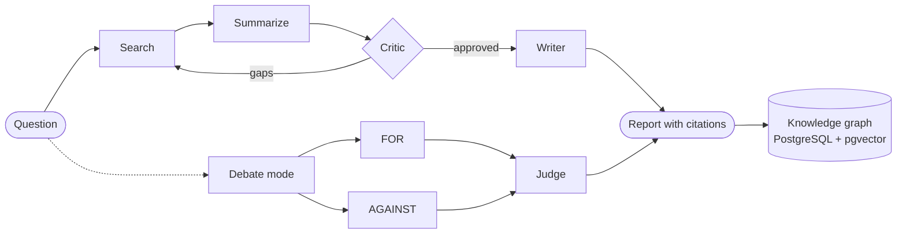
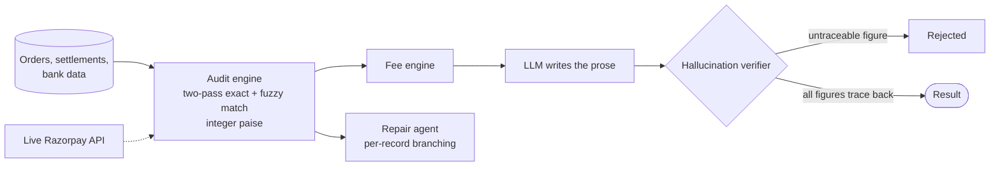
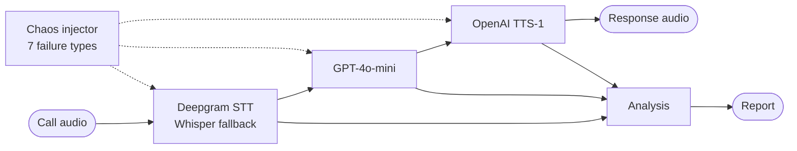
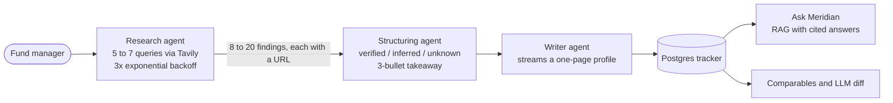
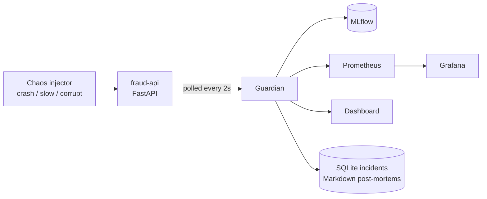
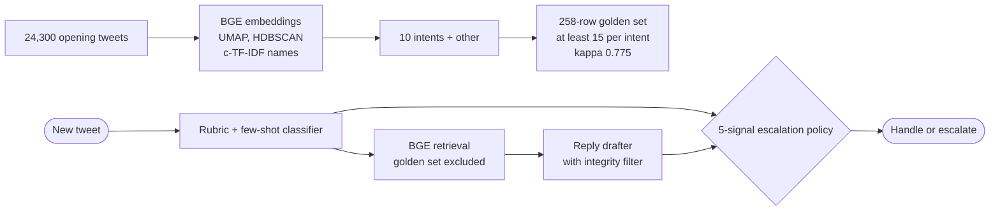
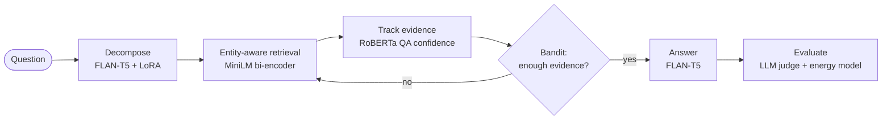

 

## About

I'm a fourth-year B.Tech student in Computer Science (AI & ML) at Manipal University Jaipur. I build LLM agents, retrieval systems and the monitoring that sits around them, and I care a lot about finding out when they are wrong.

A few habits run through everything below:

- I deploy what I build. The bigger projects have a live URL, a container and a database behind them.
- I test my own claims. That means bootstrap confidence intervals, Cohen's kappa, ablations and hallucination audits. A number that doesn't hold up doesn't go in the README.
- I keep notes on what I rejected. Decision logs and failure logs are part of the repo.

Right now I'm working on agentic systems and LLM evaluation, with some time on NLP, computer vision, drift detection and voice AI. I interned at Metabrix Lab on a 3D face reconstruction codebase, and I have one published paper and two under review.

## Projects

| # | Project | What it does | Hard part |
|:-:|:--|:--|:--|
| 1 | [POLYNOUS](#polynous) | Seven-agent research platform with a per-user knowledge graph | Stateful orchestration, plus graph ML at request time |
| 2 | [ReconMint](#reconmint) | Payment reconciliation where every number comes from code | Stopping the LLM from stating a figure it can't trace |
| 3 | [CallAutopsy](#callautopsy) | Failure analysis for voice AI calls | Pinning each failure on one pipeline stage |
| 4 | [Meridian](#meridian) | AI analyst for private-market fund managers in India and Southeast Asia | Sourced extraction with per-field confidence |
| 5 | [GuardianOps](#guardianops) | Safety net for a fraud-detection API | Catching wrong answers from a service that looks healthy |
| 6 | [Delta Support Agent](#delta-support-agent) | Triage and reply agent for airline support tweets | Evaluation strong enough to contradict my own claims |
| 7 | [EcoBudget](#ecobudget) | Question answering that stops retrieving once it has enough | Trading accuracy against compute and energy |

## POLYNOUS

POLYNOUS is a research platform where seven agents run on LangGraph. You ask a question and they search, summarize, critique, debate and write a structured report with live web citations and confidence scores. What they find is saved to a knowledge graph that belongs to each user, so later sessions start from earlier work.

Most agent demos are one chain. This one is a stateful graph with a critic that can send work back to the search step, and a debate mode where separate agents argue for and against a claim. Several authenticated users can use it at once, each with their own API keys for seven providers.

What's in it

| Part | How it works | Tech |
|:--|:--|:--|
| Agent pipeline | Search, Summarize, Critic, Writer, Debate over an explicit state graph | LangGraph, Claude, GPT-4o-mini |
| Debate mode | FOR, AGAINST and Judge agents argue a claim, streamed live | Claude, SSE |
| Knowledge graph | Typed relationship traversal over each user's entities | PostgreSQL, pgvector |
| Graph ML | PageRank, community detection and link prediction, computed per request | Pure Python, Canvas, Three.js |
| Semantic search | A constellation view over embedded findings | Pinecone, Voyage AI |
| Bring your own keys | Seven providers, encrypted at rest, never logged | Fernet (AES-128-CBC) |
| Auth | Google and GitHub OAuth 2.0 with JWT sessions | FastAPI |
| PDF analysis | Upload, chunk and retrieve, with a security scan on ingest | PyPDF2 |
| Analytics | Dashboard drawn on a raw canvas, no chart library | Canvas API |
| Deploy | React/Vite on Cloudflare Pages, FastAPI on Railway | Docker |

## ReconMint

I built ReconMint for the Razorpay AI Buildathon 2026. It reconciles orders, settlements and bank records using a deterministic matching and fee engine. The LLM only writes the explanations, and a verifier rejects any figure in that text that can't be traced to computed data.

<table align="center">
<tr>
<td align="center"><h3>97.7%</h3>match rate</td>
<td align="center"><h3>~12,700</h3>records per second</td>
<td align="center"><h3>1.00</h3>recall</td>
<td align="center"><h3>0.93</h3>F1 on held-out truth</td>
</tr>
</table>

The matcher does an exact pass and then a confidence-scored fuzzy pass, using integer paise to avoid float errors. I removed an O(n²) bottleneck to reach the throughput above. The live Razorpay API acts as an independent check on the results, and a repair agent handles individual records that fail to match. Everything is written to an audit log, and the React front end shows the agent trace as it runs.

My reasoning: in finance, a model that is confidently wrong is worse than no model. So the code produces the numbers, the model writes the sentence around them, and a verifier sits between the two.

## CallAutopsy

Most voice-agent testing asks whether the call finished. CallAutopsy asks where it broke. It treats a call as three stages (speech-to-text, LLM, text-to-speech), runs on a real pipeline instead of mocks, and produces a report that names the stage that failed.

I can inject seven kinds of failure on purpose: bad STT, LLM hallucination, TTS glitch, timeout, hangup, network failure and unhandled exception. After each call the system writes up the failure class, the responsible stage, a per-stage timeline, the evidence, what the call cost, a postmortem, and suggested fixes.

There are also a few tools for judging the analysis itself:

- A calibration confusion matrix, to check whether the failure classifier can be trusted
- A blast radius calculator, which estimates damage beyond a single call
- A/B comparison between pipeline configurations
- An adversarial hallucination suite for the LLM stage
- Microphone analysis, for input quality problems

## Meridian

I built this as my application for the Lanmea Group AI & Software Engineering internship. Their listing described a tool they needed, so I made it instead of sending a resume.

You type a fund manager's name. Three agents research them, put the findings into a strict Postgres schema with a confidence tag on every field, write an analyst takeaway, and file the result in a shared tracker you can query in plain English.

The research agent writes five to seven queries per firm, covering fund history, AUM, portfolio, leadership, sector thesis and recent activity. Each fact it extracts carries its source URL. The structuring agent tags every field as verified, inferred or unknown with a source, and the takeaway may only use numbers that already appear in the profile. Progress streams over SSE the whole way.

Features

| Feature | Detail |
|:--|:--|
| Ask Meridian (Cmd+K) | RAG across every firm's findings, answers cited as [n], firm names are links |
| Comparables | The three closest firms for each profile, scored on sector, stage and geography |
| Compare | Two to four firms side by side, with an LLM summary of what separates them |
| Real entities | `fund_managers`, `deals`, `people` and `findings` are separate tables with foreign keys, so cross-firm queries are plain SQL |
| Signal card | Recent fund closes and the most recently updated firms |
| Notes and watchlist | Autosaved analyst notes, starred firms kept per browser |
| Exports | CSV, Markdown, print-styled PDF |
| Weekly refresh | A GitHub Action calls `/api/refresh` every Monday to re-profile stale rows |
| Hardening | CORS, security headers, per-IP rate limiting with slowapi, optional shared secret, non-root Docker user |

The rules I held myself to: nothing is shown as verified without a source, confidence is shown rather than implied, and empty states never fake data. Seed rows are labeled `seed`.

## GuardianOps

A fraud-detection API can fail in two ways. It can crash, which is obvious and someone gets paged. Or it can keep running while giving bad answers, because a model was corrupted or an upstream pipeline shifted. Every health check stays green and fraud gets approved. The second kind costs more and most monitoring misses it.

GuardianOps polls the API every two seconds and compares a rolling window of recent values against a frozen baseline using PSI and a Kolmogorov-Smirnov test. It then follows one of two policies.

| Policy | Trigger | What happens |
|:--|:--|:--|
| P-001 | Crash | Auto-restart. The incident is logged with its real MTTR. |
| P-002 | Silent failure | Open an incident and wait for a person to approve the rollback. A live fraud model shouldn't be changed without compliance sign-off. |

Details

| Area | What's there |
|:--|:--|
| Drift | PSI and `scipy.stats.ks_2samp` over a 60-sample window against a 200-sample baseline taken at startup |
| Confidence | A 0 to 100 gauge that falls smoothly as PSI rises, so you see drift build before an alert fires |
| Explanations | Each incident records PSI, the KS p-value, the threshold and the policy that fired |
| Chaos | A separate service with three modes: crash, slow, and corrupt (a shifted Beta distribution with no crash and no latency change) |
| Ground truth | 500 deterministic card transactions with about 4% injected fraud. `POST /replay` returns a confusion matrix, precision, recall and F1 |
| Live config | `POST /config` changes thresholds and polling rate without a restart |
| Dashboard | One HTML file with no build step: a live trace, session ledger, baseline vs live histogram, narration console and a printable incident report |
| Ops | Seven-service Docker Compose, GitHub Actions CI with three parallel jobs, nine pytest cases, and an `audit.sh` that probes all 21 endpoints |

Some limits I wrote down in the repo instead of hiding: the scorer is rule-based on purpose, since the project is the safety net and not the model. The live transaction stream is synthetic, while the replay set is labeled. One settings slider is disabled and marked "(fixed)" because that's more honest than a control that does nothing.

## Delta Support Agent

This agent triages and answers Delta's support tweets, using the Kaggle Customer Support on Twitter dataset. I picked one brand out of about 100, built the intent categories from the data instead of inventing them, and hand-labeled 258 tweets as a golden set. The agent classifies intent, drafts a reply based on Delta's own past replies, and decides whether to handle the tweet or escalate it.

Results on a held-out slice of 78 rows:

| System | Intent accuracy | Intent macro-F1 | Escalate F1 | Reply score (judge) | Reply score (human-adjusted) |
|:--|:-:|:-:|:-:|:-:|:-:|
| Trivial baseline | 19.2% | 0.029 | 0.836 | 3.42 | 2.67 |
| TF-IDF + logistic regression | 37.2% | 0.378 | 0.625 | 4.17 | 3.42 |
| **LLM-RAG agent** | **71.8%** | **0.731** | **0.879** | **4.57** | **3.78** |

Replies are scored by a gpt-4o-mini judge on groundedness, tone, actionability and safety. The agent itself uses gpt-4o, so the judge comes from a different model family to reduce self-preference. I checked the judge against 40 rows I scored by hand (Pearson r = 0.65). It over-scores actionability by 1.4 points, so the human-adjusted column corrects for that per axis.

The intents came from clustering 24,300 opening tweets. The golden set has a floor of 15 per intent, and my agreement with my own labels on a blind 40-row re-label was kappa 0.775. The retrieval index leaves out the golden set so nothing leaks. Escalation uses five signals combined with OR, because asking one LLM "should we escalate?" isn't a policy.

What the evaluation caught that a demo would not have:

- A `grounded_in` audit found the model making up tweet IDs in 6 of 78 replies. After I tightened the prompt, that dropped to 0 of 78.
- When I hand-labeled an escalation subset, my derived escalation labels agreed with me at only kappa 0.29. The escalation numbers I had been reporting were inflated because they were measured against a weak proxy, and I changed the report to say so.
- I wrote down three kappa predictions before running the check. Two were wrong, and the report says that.
- A 27-entry decision log lists the options I rejected and why.

## EcoBudget

EcoBudget is a research project on how little a question-answering system can retrieve and still answer correctly. The idea is task-sufficient retrieval: instead of pulling whole pages or searching until it runs out of ideas, the system tracks what it has found and stops when that's enough.

<table align="center">
<tr>
<td align="center"><h3>0.989</h3>Recall@1</td>
<td align="center"><h3>1.000</h3>Recall@5</td>
<td align="center"><h3>0.892</h3>decomposition exact match</td>
<td align="center"><h3>0.895</h3>task success</td>
<td align="center"><h3>0.944</h3>fact F1</td>
<td align="center"><h3>~66 J</h3>saved per query</td>
</tr>
</table>

| Piece | Job |
|:--|:--|
| FLAN-T5 with LoRA | Breaks a question into sub-queries |
| MiniLM bi-encoder | Retrieval |
| RoBERTa QA confidence | Signals whether the evidence is enough |
| LinUCB, SGD bandit, Thompson sampling | Decide whether to retrieve again or stop |
| Energy model | Estimates the cost of retrieval |

In the evaluated setup it retrieved about 106 bytes per query, against about 420 bytes per query for full-page retrieval. The energy figure assumes a median page size of roughly 506 KB.

The question I kept coming back to: how little evidence can a system retrieve and still get the answer right?

## Research

<table>
<tr>
<td>

### FedCL-NIDS: federated closed-loop intrusion detection with automated YARA rule voting

*Kasmya Bhatia, Ashwarya Pradhan, Dr. Gautam Kumar. Dept. of AI & ML, Manipal University Jaipur.*

We designed a federated learning setup for intrusion detection where each node trains locally and no raw data is shared. The system also generates YARA threat signatures automatically, and nodes vote to accept or reject each one. That voting step is what lowers false positives and lets the system pick up new attacks.

</td>
</tr>
<tr>
<td>

### Dissociation between transparency, trust and error detection in AI-assisted decision making

A within-subject study with 54 participants, which I co-authored. People trusted and preferred the transparent interface, but they did not catch more errors with it. They preferred the interface that did not make them better at the task. The analysis used Holm-corrected paired tests, GEE models and bootstrap confidence intervals.

</td>
</tr>
<tr>
<td>

### KYRION: auditing LLM-generated Python code

A framework that checks LLM-written Python for hallucinated dependencies, instruction adherence and static-analysis issues. It reached 1.00 recall on the validation set and found model-specific coding habits that were statistically significant (p < 10^-12). I compared it against Bandit, Ruff and Pylint.

</td>
</tr>
</table>

## Experience

**Machine Learning Intern, Metabrix Lab** (June to September 2025)

I debugged and optimized the HRN (Hierarchical Representation Network) codebase for 3D face reconstruction. I fixed bugs that were hurting accuracy and inference stability, maintained the production code, and wrote the technical documentation that new engineers used to get started.

## Stack

| Area | Tools |
|:--|:--|
| LLMs and agents | LangGraph, LangChain, Claude, GPT-4o and 4o-mini, prompt hardening, tool use |
| Retrieval and data | PostgreSQL, pgvector, Pinecone, Voyage AI, BGE, MiniLM, Tavily, SQLite |
| ML and evaluation | PyTorch, TensorFlow, scikit-learn, FLAN-T5 and LoRA, RoBERTa, UMAP, HDBSCAN, bandits, bootstrap CIs, Cohen's kappa, LLM-as-judge |
| Voice | Deepgram, Whisper, OpenAI TTS |
| MLOps | MLflow, Prometheus, Grafana, Docker Compose, GitHub Actions, pytest, Cloudflare, Railway |

## GitHub activity

  

<picture>
  <source media="(prefers-color-scheme: dark)" srcset="https://raw.githubusercontent.com/pradhanashwarya2122/pradhanashwarya2122/output/galaga-contribution-graph-dark.svg">
  <source media="(prefers-color-scheme: light)" srcset="https://raw.githubusercontent.com/pradhanashwarya2122/pradhanashwarya2122/output/galaga-contribution-graph.svg">
  
</picture>

## Contact

I'm looking for AI/ML engineering internships and research collaborations, especially on agent systems. If you're hiring, pick any project above and I'll walk you through the code and the numbers.

